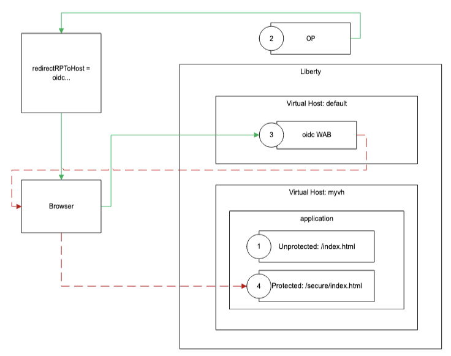

# helloworldoidc

This is an example application demonstrating [Liberty OIDC support](https://openliberty.io/docs/latest/reference/feature/openidConnectClient.html) with application virtual hosts.

The `openidConnectClient` configuration in [server.xml](src/main/liberty/config/server.xml) must be customized for your particular OIDC provider.

Usage for the example provider:

1. Add host name mappings to your local computer's hosts file; for example, to `/etc/hosts` on macOS/Linux (or `%WinDir%\System32\Drivers\Etc\hosts` on Windows):
   ```
   127.0.0.1 oidc.test.ibm.com test.ibm.com
   ```
2. Trust the OIDC provider:
   ```
   keytool -genkey -storepass overrideme -alias default -keystore src/main/liberty/config/customtruststore.p12 -storetype PKCS12 -keyalg RSA -validity 365 -keysize 2048 -dname "CN=example.com, OU=ID, O=Example, L=Example, S=Example, C=Example"
   keytool -importcert -storepass overrideme -alias ... -file ...crt -keystore src/main/liberty/config/customtruststore.p12 -noprompt
   keytool -importcert -storepass overrideme -alias ... -file ...crt -keystore src/main/liberty/config/customtruststore.p12 -noprompt
   ```
3. Start Liberty with the necessary provider configuration:
   
   `mvn -Dliberty.var.oidc.clientId=... -Dliberty.var.oidc.clientSecret=... -Dliberty.var.oidc.authorizationEndpointUrl=... -Dliberty.var.oidc.issuerIdentifier=... -Dliberty.var.oidc.jwkEndpointUrl=... -Dliberty.var.oidc.validationEndpointUrl=... -Dliberty.var.oidc.tokenEndpointUrl=... -Dliberty.var.testuser=... clean install liberty:run`
4. Access <https://test.ibm.com:9443/>
5. Enter the secure area to start the flow


